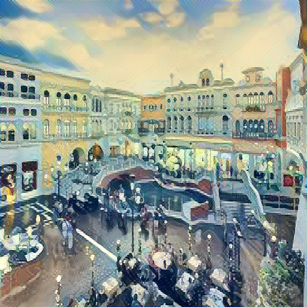

# Artistic style transfer using convolutional neural network

The repository contains the code for artistic style transfer using convolutional neural network written using keras and Tensorflow as mentioned in the [A Neural Algorithm of Artistic Style](https://arxiv.org/abs/1508.06576). 

**Important**
I ran this code on my laptop which had Nvidia GPU installed, which is why I used tensorflow-gpu to take advantage of my laptop GPU. If
  your machine doesn't have GPU, then modify line 56 from
  `tensorflow-gpu==1.9.0` to `tensorflow==1.9.0`
  
**Setup**

 1. Make sure that Python (3.6), pip and conda are installed in your system.
 2. Now, create a new conda environment as: 
 `conda create --name artisticenv python=3.6 pip`
3.  Now, activate this environment as follows:
	- Windows:  `activate artisticenv`
	- Linux and macOS:  `source activate artisticenv`
4. Clone this repository: 
`git clone https://github.com/vishav/neuralstyletransfer.git`
6. Change directory to neuralstyletransfer
7. Install the project requirements from requirements.txt as follows: 
`pip install - r requirements.txt`
8. Now, start jupyter and run the notebook: 
	`jupyter notebook`

